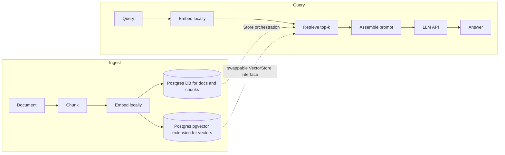

# <!-- FLAG: project name --> RAG Service
 
Ask natural-language questions over your own documents. The service ingests a
document, splits it into chunks, embeds them locally, and stores the vectors. At
query time it retrieves the most relevant chunks and grounds an LLM's answer in
them — so answers are tied to your source material, not the model's training data.
 
Built backend-first as a learning vehicle: the goal was *correct end-to-end with
every line understood*, not a production deployment. Auth, observability, and rate
limiting are explicitly out of scope for this version.
 
## Highlights
 
- **Swappable vector-store seam** — all vector access goes through one interface, so
  migrating from pgvector to a dedicated vector DB is a bounded task, not a rewrite.
- **Layered store/service architecture** — persistence and business logic are
  separated, and ORM objects never escape the store layer (converted to DTOs at the
  boundary), so the app depends on plain data, not live session state.
- **Deliberate test strategy** — three-tier embedder (dummy / known / real vectors),
  per-test DB isolation, and a faked LLM transport, so the suite is fast and runs with
  zero network calls.
---

## Architecture

The core design choice is a **swappable vector-store seam**: all vector access goes
through one interface, so the RAG logic never touches pgvector directly. Migrating
to a dedicated vector DB (ChromaDB) later is a bounded task behind that seam, not a
rewrite.

The codebase is split into two layers:

- **Stores** (`DocStore`, `ChunkStore`, `VectorStore`) — own persistence only. They
  receive a session as an argument; they do not own or open it.
- **Services** (`IngestionService`, `RetrievalService`, `QueryService`) — own the
  business logic and orchestrate stores within a transaction.

ORM objects never escape the store layer; they're converted to DTOs at the boundary
so the rest of the app depends on plain data, not on live SQLAlchemy session state.


<!-- FLAG: this diagram is my reconstruction of your flow from our past work.
     Check the ingest write order and whether retrieval reads from pgvector
     directly or always through the VectorStore interface (it should be the latter). -->

**Notable decisions** (full rationale in [`DECISIONS.md`](./DECISIONS.md)):

- **Embedding is a separate component from the vector store.** The store only
  persists/retrieves vectors someone else produced — it never embeds. This keeps the
  seam clean (pgvector can't embed anyway) and guarantees the *same* embedder is used
  for both ingest and query, so both live in one vector space.
- **The embedding model fixes the vector dimension** (384, baked into the pgvector
  column). One model is chosen and kept for the whole MVP.
- **Exact brute-force cosine search** (`<=>`), no HNSW/IVFFlat index. At MVP scale an
  approximate index buys nothing; revisit at tens of thousands of vectors.
- **Retrieval uses a distance threshold *and* top-k** — the threshold is a quality
  gate, top-k is a ceiling.
- **Session-per-method**: stores take a session as an argument rather than owning one,
  keeping transaction boundaries in the service layer.
- **No Alembic in v1** — schema changes are drop-and-recreate. Migration discipline is
  a deferred phase.

---

## Tech stack

| Layer | Choice | Why |
|---|---|---|
| API | FastAPI (async) | RAG is I/O-bound JSON endpoints, not server-rendered pages |
| DB | PostgreSQL + pgvector | text and vectors stay consistent in one datastore at MVP scale |
| ORM | SQLAlchemy async + asyncpg | models the document↔chunk relation cleanly |
| Embeddings | sentence-transformers (`all-MiniLM-L6-v2`, 384-dim) | small, free, runs locally — unlimited dev loop |
| Generation | <!-- FLAG: confirm --> Gemini Flash via `httpx` | generation models are too large to host; API call instead |
| Tests | pytest + pytest-asyncio | — |

---

## Quickstart

**Prerequisites:** Docker + Docker Compose.

```bash
# 1. Create a .env (compose auto-loads it)
cat > .env <<'EOF'
POSTGRES_PASSWORD=change-me
LLM_API_KEY=your-gemini-api-key   # required — generation calls Gemini
EOF

# 2. Build and start the stack (db + api)
docker compose up --build
```

> ⏳ **First build/run is slow.** The api image installs **PyTorch** (~a few GB), and
> on first startup the embedding model is downloaded. Expect several minutes the first
> time — later runs are fast.

Once it's up:

- 🌐 API → <http://localhost:8000>
- 📖 Interactive docs (Swagger) → <http://localhost:8000/docs>

The database schema (pgvector extension + tables) is created automatically on startup.

### Run locally (without Docker)

```bash
pip install -e .                       # needs Python 3.12
# Postgres with pgvector running; set DB_PASSWORD + LLM_API_KEY in .env
uvicorn rag_app.api.main:app --reload
```

### Example

A full ingest → ask → fetch round-trip:

```bash
# 1. Ingest a document — returns its id
curl -X POST http://localhost:8000/ingest/store \
  -H "Content-Type: application/json" \
  -d '{
        "filename": "pangram.txt",
        "content": "The quick brown fox jumps over the lazy dog.",
        "metadata": {"source": "demo"}
      }'
# → "3fa85f64-5717-4562-b3fc-2c963f66afa6"

# 2. Ask a question — the answer is grounded in your ingested documents
curl -X POST http://localhost:8000/query/generate \
  -H "Content-Type: application/json" \
  -d '{"query": "What does the fox jump over?"}'
# → "The fox jumps over the lazy dog."

# 3. (optional) Fetch a stored document by id
curl http://localhost:8000/query/documents/3fa85f64-5717-4562-b3fc-2c963f66afa6
```

---

## Project layout

```
src/rag_app/
  api/          # FastAPI app, routes, dependencies
  services/     # IngestionService, RetrievalService, AnswerService
  stores/       # DocStore, ChunkStore, VectorStore (persistence only)
  models/       # SQLAlchemy ORM models
  chunkings/    # chunker + factory
  embeddings/   # sentence-transformers wrapper
  llm/          # LLM client + factory + prompter
  db/           # engine, base, startup bootstrap
tests/
```

---

## Testing

Run the suite with:

```bash
python -m pytest
```

The test design is deliberate:

- **Isolation** via truncate-before-yield fixtures, so each test starts from a clean DB.
- **Three-tier embedder strategy**: dummy vectors for store/ingest tests, hand-placed
  known vectors for retrieval-SQL tests (so distances are predictable), and the real
  model only for end-to-end tests.
- **The LLM client is faked** with `httpx.MockTransport` — no network calls in tests.

---

## Status & roadmap

- **v1 MVP — complete.** Ingest → chunk → embed → store → retrieve → prompt → answer,
  end-to-end, with a passing test suite.
- **Next:** ChromaDB migration behind the existing vector-store seam (the planned
  adaptability demonstration), then deployment.
- **Deferred by design:** auth, reranking, streaming, multiple collections, migration
  tooling (Alembic), observability, rate limiting.

---

## License

<!-- FLAG: pick one (MIT is the conventional default for a portfolio project) -->