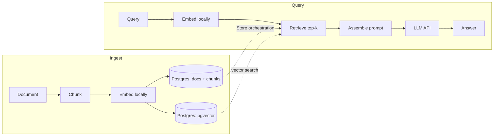

# <!-- FLAG: project name --> RAG Service
 
Ask natural-language questions over your own documents. The service ingests a
document, splits it into chunks, embeds them locally, and stores the vectors. At
query time it retrieves the most relevant chunks and grounds an LLM's answer in
them — so answers are tied to your source material, not the model's training data.
 
Built backend-first as a learning vehicle: the goal was *correct end-to-end with
every line understood*, not a production deployment. Auth, observability, and rate
limiting are explicitly out of scope for this version.
 
## Highlights
 
- **Atomic ingest & delete** — documents, chunks and vectors live in one Postgres DB,
  so a store or a delete is a single transaction: it fully happens or fully rolls back,
  with no orphaned chunks or vectors.
- **Layered store/service architecture** — persistence and business logic are
  separated, and ORM objects never escape the store layer (converted to DTOs at the
  boundary), so the app depends on plain data, not live session state.
- **Deliberate test strategy** — three-tier embedder (dummy / known / real vectors),
  per-test DB isolation, and a faked LLM transport, so the suite is fast and runs with
  zero network calls.
---

## Architecture

The core design choice is a **single Postgres datastore**: documents, chunks and
vectors (via pgvector) all live in one database. That's what makes ingest and delete
**atomic** — a service opens one transaction and writes (or deletes) all three
together, so there is no window in which chunks exist without their vectors, or vice
versa.

The codebase is split into two layers:

- **Stores** (`DocStore`, `ChunkStore`, `PgVectorStore`) — own persistence only. Each
  is stateless and receives a session as an argument; it does not own or open it.
- **Services** (`IngestionService`, `RetrievalService`, `QueryService`) — own the
  business logic and orchestrate stores within a transaction.

ORM objects never escape the store layer; they're converted to DTOs at the boundary
so the rest of the app depends on plain data, not on live SQLAlchemy session state.


<!-- FLAG: this diagram is my reconstruction of your flow from our past work.
     Check the ingest write order (docs + chunks + vectors now commit in one
     transaction) and that retrieval reads through PgVectorStore.search. -->

**Notable decisions** (full rationale in [`DECISIONS.md`](./DECISIONS.md)):

- **Embedding is a separate component from the vector store.** The store only
  persists/retrieves vectors someone else produced — it never embeds. This keeps the
  seam clean (pgvector can't embed anyway) and guarantees the *same* embedder is used
  for both ingest and query, so both live in one vector space.
- **The embedding model fixes the vector dimension** (384, baked into the pgvector
  column). One model is chosen and kept for the whole MVP.
- **Exact brute-force cosine search** (`<=>`), no HNSW/IVFFlat index. At MVP scale an
  approximate index buys nothing; revisit at tens of thousands of vectors.
- **Retrieval uses a distance threshold *and* top-k** — the threshold is a quality
  gate, top-k is a ceiling.
- **Session-per-method**: stores take a session as an argument rather than owning one,
  keeping transaction boundaries in the service layer.
- **Alembic-managed schema** — the schema (with row-level-security multi-tenancy) lives
  in a single initial migration; because there's no real data yet, the DB is **reset from
  scratch** rather than mutated, and no destructive op ever lives inside a migration.
  The running app connects as the least-privilege `app_user` (so RLS is enforced) and no
  longer creates schema on boot; `alembic upgrade head` (run as the owner) applies it (see
  DECISIONS.md → *Migrations & Multi-tenancy*).

---

## Tech stack

| Layer | Choice | Why |
|---|---|---|
| API | FastAPI (async) | RAG is I/O-bound JSON endpoints, not server-rendered pages |
| DB | PostgreSQL + pgvector | text and vectors stay consistent in one datastore at MVP scale |
| ORM | SQLAlchemy async + asyncpg | models the document↔chunk relation cleanly |
| Embeddings | sentence-transformers (`all-MiniLM-L6-v2`, 384-dim) | small, free, runs locally — unlimited dev loop |
| Generation | <!-- FLAG: confirm --> Gemini Flash via `httpx` | generation models are too large to host; API call instead |
| Tests | pytest + pytest-asyncio | — |

---

## Quickstart

**Prerequisites:** Docker + Docker Compose.

```bash
# 1. Create a .env (compose auto-loads it)
cat > .env <<'EOF'
POSTGRES_PASSWORD=change-me
APP_USER_PASSWORD=change-me-too   # least-privilege RLS role, created on a fresh volume
LLM_API_KEY=your-gemini-api-key   # required — generation calls Gemini
EOF

# 2. Build images, start Postgres, and apply the schema as the OWNER (raguser).
#    The app runs as the least-privilege app_user and does NOT create schema on boot,
#    so the migration must run first.
docker compose build
docker compose up -d pg
docker compose run --rm api alembic upgrade head

# 3. Start the app
docker compose up api
```

> ⏳ **First build/run is slow.** The api image installs **PyTorch** (~a few GB), and
> on first startup the embedding model is downloaded. Expect several minutes the first
> time — later runs are fast.

Once it's up:

- 🏠 Homepage (portfolio + contact) → <http://localhost:8000/>
- 🧪 Live demo (ingest → retrieve → answer) → <http://localhost:8000/demo.html>
- 📖 Interactive docs (Swagger) → <http://localhost:8000/docs>

The database schema is applied by the Alembic migration in step 2 (the pgvector extension
and the users, documents, chunks and vectors tables, with RLS). The app itself connects as
`app_user` and does not create schema.

> **Migrations & multi-tenancy.** The RLS-enabled schema is defined by an Alembic
> migration (`alembic upgrade head`); a fresh volume auto-provisions the `app_user` role
> via `init-app-user.sh`. To reset from scratch (safe — no real data): local
> `docker compose down -v` then re-run the migration; on prod/Neon create `app_user` once
> via the console, then `alembic upgrade head`. Never truncate/backfill inside a migration.

### Run locally (without Docker)

```bash
pip install -e .                       # needs Python 3.12
# Postgres with pgvector running. In .env set:
#   DATABASE_URL      -> owner (raguser) connection, used by Alembic
#   APP_DATABASE_URL  -> app_user connection, used by the running app (RLS applies)
#   SECRET_KEY        -> signs the anonymous owner cookie
#   LLM_API_KEY       -> generation
alembic upgrade head                   # apply schema as the owner (DATABASE_URL), once
uvicorn rag_app.api.main:app --reload
```

### Example

A full ingest → ask → fetch round-trip. Each visitor is an anonymous tenant identified by a
signed `owner` cookie; ingest mints it, and the reads only see your own documents, so carry
the cookie across calls (`-c`/`-b` a cookie jar):

```bash
# 1. Ingest a document — mints the owner cookie (saved to cookies.txt), returns the doc id
curl -c cookies.txt -X POST http://localhost:8000/ingest/store \
  -H "Content-Type: application/json" \
  -d '{
        "filename": "pangram.txt",
        "content": "The quick brown fox jumps over the lazy dog.",
        "metadata": {"source": "demo"}
      }'
# → "3fa85f64-5717-4562-b3fc-2c963f66afa6"

# 2. See what retrieval finds — the top-k chunks for a query, in similarity order
curl -b cookies.txt -X POST http://localhost:8000/query/retrieve \
  -H "Content-Type: application/json" \
  -d '{"query": "What does the fox jump over?"}'
# → ["The quick brown fox jumps over the lazy dog."]

# 3. Ask a question — the answer is grounded in your ingested documents
curl -b cookies.txt -X POST http://localhost:8000/query/generate \
  -H "Content-Type: application/json" \
  -d '{"query": "What does the fox jump over?"}'
# → "The fox jumps over the lazy dog."

# 4. (optional) Fetch a stored document by id
curl -b cookies.txt http://localhost:8000/query/documents/3fa85f64-5717-4562-b3fc-2c963f66afa6
```

---

## Project layout

```
src/rag_app/
  api/          # FastAPI app, routes, dependencies
  services/     # IngestionService, RetrievalService, AnswerService
  stores/       # DocStore, ChunkStore, VectorStore (persistence only)
  models/       # SQLAlchemy ORM models
  chunkings/    # chunker + factory
  embeddings/   # sentence-transformers wrapper
  llm/          # LLM client + factory + prompter
  db/           # engine, base, startup bootstrap
  static/       # homepage + demo frontend (plain HTML/CSS/JS, no build step)
tests/
```

---

## Testing

Run the suite with:

```bash
python -m pytest
```

The test design is deliberate:

- **Isolation** via truncate-before-yield fixtures, so each test starts from a clean DB.
- **Three-tier embedder strategy**: dummy vectors for store/ingest tests, hand-placed
  known vectors for retrieval-SQL tests (so distances are predictable), and the real
  model only for end-to-end tests.
- **The LLM client is faked** with `httpx.MockTransport` — no network calls in tests.

---

## Status & roadmap

- **v1 MVP — complete.** Ingest → chunk → embed → store → retrieve → prompt → answer,
  end-to-end, with atomic store/delete and a passing test suite.
- **Next:** deployment (single service against a managed Postgres with pgvector).
- **In progress:** row-level multi-tenancy (Postgres RLS + `app_user`) and wiring the app
  onto Alembic migrations. Real tenant isolation is blocked on **auth** (see below).
- **Deferred by design:** auth, reranking, streaming, multiple collections, observability,
  rate limiting.

---

## License

<!-- FLAG: pick one (MIT is the conventional default for a portfolio project) -->